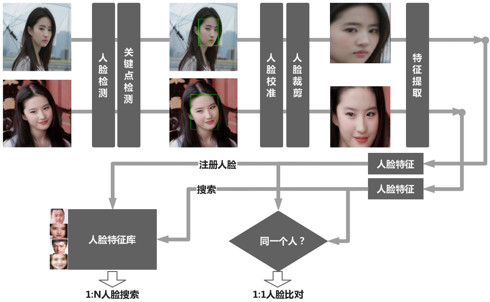

# Face-Recognition-Python

## 1.介绍

人脸识别系统Python

## 2.项目结构

```
.
├── configs                # 配置文件(设置检测模型，特征提取模型)
├── core
│   ├── alignment          # 人脸校准算法
│   ├── detection          # 人脸检测模型
│   ├── feature            # 人脸特征提取模型
│   ├── face_detector.py   # 人脸检测(支持MTCNN和RFB)
│   ├── face_feature.py    # 人脸特征提取模型
│   ├── face_matcher.py    # 人脸匹配算法
│   ├── face_recognizer.py # 人脸识别 
│   └── face_register.py   # 人脸注册
├── data                   # 人脸识别相关数据
├── face_compare.py        # 1:1人脸比对Demo
├── face_search.py         # 1:N人脸搜索Demo
├── register.py            # 1:N人脸搜索人脸数据库注册Demo
├── README.md              # 说明文档
└── requirements.txt       # 项目依赖文件
```

## 3.安装

- 依赖Python包：[requirements.txt](./requirements.txt)

```bash
# 先安装Anaconda3
# 在conda新建虚拟环境pytorch-py36(如果已经存在，则无需新建)
conda create -n pytorch-py36 python==3.6.7
# 激活虚拟环境pytorch-py36(每次运行都需要运行)
conda activate  pytorch-py36
# 安装工程依赖的包(如果已经安装，则无需安装)
pip install -r requirements.txt
```

## 4.人脸识别


### (1) 人脸比对(1:1)
1:1人脸比对(也称人脸验证，身份验证)，即将两张人脸进行1:1比对，得到人脸相似度，来判断是否是同一个人，一般用作人证比对等场景，比如银行卡/QQ/微信/支付宝等账号登录时人脸身份验证。

```bash
python face_compare.py --image_file1 "data/test_image/test1.jpg" --image_file2 "data/test_image/test2.jpg"
```

### (2) 人脸搜索(1:N)

1:N人脸搜索，精确搜索匹配在预设人脸库中的相似人脸，将一张人脸和N张人脸进行比对，找出最相似的一张或多张人脸，即1:N人脸搜索。可用作人脸签到、人脸门禁、人员信息查询、安防监控等应用场景。

```bash
# 注册人脸
python register.py
# 人脸搜索(1:N)
python face_search.py
```
